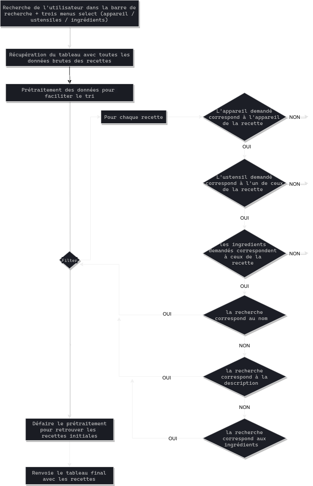

# Les Petits Plats

Les Petits Plats est un moteur de recherche qui permet de trouver rapidement des recettes adaptées aux ingrédients et aux ustensiles que vous avez sous la main. Projet 7 de la formation OpenClassrooms "Développeur Front End".

L'application consiste en une page simple, réalisée avec Javascript (vanilla) dans un paradigme [Orientée Prototype](https://en.wikipedia.org/wiki/Prototype-based_programming) en utilisant des [Web Components](https://developer.mozilla.org/en-US/docs/Web/Web_Components). Sur cette page un moteur de recherche permet de chercher dans une database de 50 recettes (représentée par un fichier JSON) soit via des mots clés (qui vont matcher avec le nom, la description ou la liste d'ingrédient des recettes) soit via un sélecteur d'ingrédients, d'ustensils ou d'appareils.

La partie recherche (algo) a été séparée de l'application front (permet l'utisation de son "API" par différents front, avec des présentations différentes, améliore également la maintabilité), réalisée avec Javascript (vanilla) dans un paradigme [Fonctionnel](https://en.wikipedia.org/wiki/Functional_programming). Il existe en fait deux algorythmes différents pour cette recherche, `search.js` et `searchB.js`. Le second algorithme se caractérise notamment par un pré-traitement de la data et l'utilisation de méthodes plutôt que d'instructions.

Enfin, un effort particulier a été mis sur la documentation : j'utilise [JSDoc 3](https://jsdoc.app/) dont l'utilisation est facilité par le paradigme fonctionnel, ainsi que [Draw.io](https://draw.io/) pour les schémas illustrants les algorithmes.

Plusieurs pistes d'améliorations : -> j'aurais pu tester différentes structures de données pour le prétraitement de l'algo B, tel que les tables de hash ou une magic string -> la recherche pourrait ignorer les accents -> malgré quelques corrections, la DB contient beaucoup d'erreurs et de doublons -> le code coté front est loin d'être niquel, beaucoup de codes répétés sur les selects aurait pu être évité via un composant parent dont hériterais les enfans -> beaucoup de logique se trouve dans `search-result.js`, alors qu'utiliser un state global ou utiliser l'URL via une SPA aurait pu permettre de mieux la diviser entre les composants ou la mettre dans `index.js` tout en évitant de la répétition de code -> une partie des composants n'est pas très bien commenté -> le style aurait pu être amélioré à certains endroits

Pour être honnête, je pense que ce projet m'a moins intéressé pour plusieurs raisons : on y voit clairement la limite de JS vanilla par rapport aux frameworks / langages modernes pour faire du code bien organisé et maintenable, le JSON fournit était de piètre qualité, le défi algorithmique pas très intéressant, son critère d'évalutation peu pertinent (performance sur 50 recettes plutôt que son type de complexité), les ressources/ cours fournis pas adaptés... D'où le fait que je n'y ai pas passé plus de temps pour en peaufiner les détails.

Adresse du répo : https://github.com/GoulvenC/GoulvenClech_7_10052021

Démo live : https://oc-p7.goulven-clech.dev/

Diapo soutenance : *[Work in progress]*

## Installation

Le projet Les Petits Plats est une projet d'application web entièrement développé en Javascript Vanilla. J'utilise l'outil de développement Front End [Vite JS](https://vitejs.dev/) ainsi que le gestionnaire de packet [Yarn](https://yarnpkg.com/); pour gérer les styles j'utilise [PostCSS](https://github.com/postcss/postcss) avec les plugins [TailwindCSS](https://tailwindcss.com/) ([JIT](https://tailwindcss.com/docs/just-in-time-mode)) et [autoprefixer](https://github.com/postcss/autoprefixer).

1 - Installez [Yarn](https://yarnpkg.com/) sur votre système

2 - Téléchargez ce projet et ouvrez le dossier

3 - Installez les dépendances en tapant dans un terminal `yarn install`

3 - Lancez le live serveur de ViteJS en tapant dans un terminal `yarn dev`

4 - Pour obtenir une version production, utilisez dans un terminal `yarn build`

## Organisation du projet

`assets/` :
* `data/`, contient les données en JSON qui hydrate l'application
* `style/`, contient `main.css` où sont définis les styles CSS de bases

`pages/` :
* contient `index.js` qui est la seule page de l'application
* `components/`, contient les différents composants JavaScript utilisés dans `index.js`

`app.js`, point de départ de l'application, importe les dépendances et tout les composants

`index.html`, chargé par le navigateur quand l'utilisateur arrive sur le site, appelle `app.js`

`search.js` & `search.js`, contient toute la logique algorithme du moteur de recherche 

`package.json` & `yarn.lock`, fichiers utilisés par Yarn pour gérer les dépendances

`postcss.config.js`, fichier de configuration pour les plugins POSTCSS

`README.md` & `SCHEMAALGO1.png` & `SCHEMAALGO2.png`, le fichier que vous lisez actuellement

`tailwin.config.js`, fichier de configuration pour Tailwind, contient notamment la font et les couleurs personalisées du projet

## Architectures des algos

### Algo A

### Algo B

### Performance

| requete                    | A    | B    |
|----------------------------|------|------|
| "Poir"                     | 0.17 | 0.30 |
| "", [ "bananes","ananas" ] | 0.27 | 0.13 |
| "trop",  [ "ananas" ]      | 0.50 | 0.16 |

## License 

Il s'agit d'un projet dans le cadre de la formation [Développeur Front-End](https://openclassrooms.com/fr/paths/314-developpeur-front-end) d'OpenClassrooms. Le code est librement réutilisable, mais les images / logo et tout les éléments issus de l'énoncé ne m'appartiennent pas.

Si vous êtes aussi étudiant d'OC, vous pouvez librement vous inspirer de mon travail, mais je vous déconseille bien évidémment d'en copier des parties.