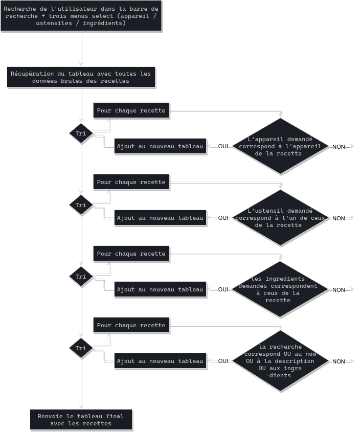

# Les Petits Plats (WIP)

Les Petits Plats est un moteur de recherche qui permet de trouver rapidement des recettes adaptées aux ingrédients et aux ustensiles que vous avez sous la main. Projet 7 de la formation OpenClassrooms "Développeur Front End".

L'application consiste en une page simple, réalisée avec Javascript (vanilla) dans un paradigme [Orientée Prototype](https://en.wikipedia.org/wiki/Prototype-based_programming) en utilisant des [Web Components](https://developer.mozilla.org/en-US/docs/Web/Web_Components). Sur cette page un moteur de recherche permet de chercher dans une database de 50 recettes (représentée par un fichier JSON) soit via des mots clés (qui vont matcher avec le nom, la description ou la liste d'ingrédient des recettes) soit via un sélecteur d'ingrédients, d'ustensils ou d'appareils.

Coté "backend", cette recherche peux être en fait deux algorithmes différents, les deux étant dans tout les cas dans `search.js`, réalisés avec Javascript (vanilla) dans un paradigme [Fonctionnel](https://en.wikipedia.org/wiki/Functional_programming). Le second algorithme se caractérise notamment par un pré-traitement de la DB, plusieurs dictionnaires sont ainsi réalisés à partir du JSON, ne comportant que les données utiles pour la recherche, permettant ainsi un traitement plus simple et plus rapide.

Enfin, un effort particulier a été mis sur la documentation : j'utilise [JSDoc 3](https://jsdoc.app/) dont l'utilisation est facilité par le paradigme fonctionnel, ainsi que [???] pour les schémas illustrants les algorithmes.

Adresse du répo : https://github.com/GoulvenC/GoulvenClech_7_10052021

Démo live : https://oc-p7.goulven-clech.dev/

Diapo soutenance : *[Work in progress]*

## Installation

Le projet Les Petits Plats est une projet d'application web entièrement développé en Javascript Vanilla. J'utilise l'outil de développement Front End [Vite JS](https://vitejs.dev/) ainsi que le gestionnaire de packet [Yarn](https://yarnpkg.com/); pour gérer les styles j'utilise [PostCSS](https://github.com/postcss/postcss) avec les plugins [TailwindCSS](https://tailwindcss.com/) ([JIT](https://tailwindcss.com/docs/just-in-time-mode)) et [autoprefixer](https://github.com/postcss/autoprefixer).

1 - Installez [Yarn](https://yarnpkg.com/) sur votre système

2 - Téléchargez ce projet et ouvrez le dossier

3 - Installez les dépendances en tapant dans un terminal `yarn install`

3 - Lancez le live serveur de ViteJS en tapant dans un terminal `yarn dev`

4 - Pour obtenir une version production, utilisez dans un terminal `yarn build`

## Organisation du projet

`assets/` :
* `data/`, contient les données en JSON qui hydrate l'application
* `style/`, contient `main.css` où sont définis les styles CSS de bases

`pages/` :
* contient `index.js` qui est la seule page de l'application
* `components/`, contient les différents composants JavaScript utilisés dans `index.js`

`app.js`, point de départ de l'application, importe les dépendances et tout les composants

`index.html`, chargé par le navigateur quand l'utilisateur arrive sur le site, appelle `app.js`

`search.js`, contient toute la logique algorithme du moteur de recherche 

`package.json` & `yarn.lock`, fichiers utilisés par Yarn pour gérer les dépendances

`postcss.config.js`, fichier de configuration pour les plugins POSTCSS

`README.md` & `SCHEMAALGO1.png` & `SCHEMAALGO2.png`, le fichier que vous lisez actuellement

`tailwin.config.js`, fichier de configuration pour Tailwind, contient notamment la font et les couleurs personalisées du projet

## Architectures des algos

### Algo 1

### Algo 2

*[Work in progress]*

## License 

Il s'agit d'un projet dans le cadre de la formation [Développeur Front-End](https://openclassrooms.com/fr/paths/314-developpeur-front-end) d'OpenClassrooms. Le code est librement réutilisable, mais les images / logo et tout les éléments issus de l'énoncé ne m'appartiennent pas.

Si vous êtes aussi étudiant d'OC, vous pouvez librement vous inspirer de mon travail, mais je vous déconseille bien évidémment d'en copier des parties.